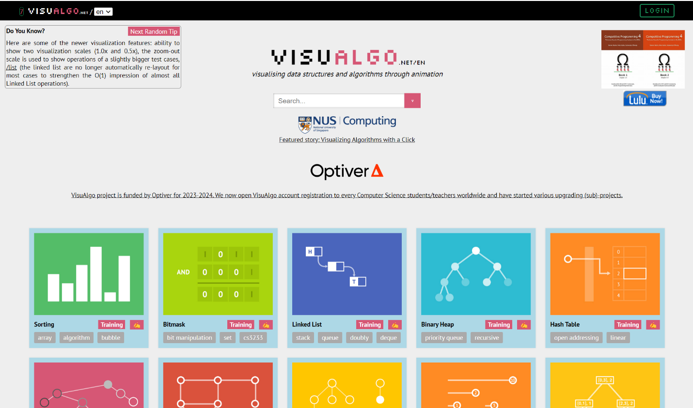

# Анализ существующих решений
## 1. Редактор графов Programforyou
Язык разработки: Javascript

Ссылка: https://programforyou.ru/graph-redactor

Начальный интерфейс представлен на рисунке 1.

**Рисунок 1 – Начальный интерфейс редактора графов Programforyou**

Описание: При открытии редактора, пользователю отображается меню и поле для построения графа. Поле имеет сетку (при желании её можно отключить) для более удобного выравнивания вершин. Меню (можно свернуть) позволяет добавлять элементы графа (вершины, рёбра, текстовые поля) на поле, выполнять загрузку и сохранение графа в различных форматах, отображать различные представления графа, а также запускать различные алгоритмы с пошаговым выполнением. В нижней части меню отображается основная информации о текущем графе – количестве вершин, рёбер и текущем масштабе. В правом нижнем углу поля находятся кнопки поиска ближайшей вер6.1.шины, отмены/повтора действий, изменения масштаба и переключения видимости сетки. В правом верхнем углу доступна кнопка для отображения информации об основных горячих клавишах, используемых в редакторе. Также в этой же части отображаются кнопки для изменения или удаления элементов графа при наличии выбранного элемента. Редактор хранит историю всех выполненных действий, так что в случае ошибки можно отменить последние действия с помощью сочетания клавиш Ctrl+Z.

Доступные функции:
1. Построение и изменение графа
    - Добавление вершин
    - Добавление рёбер (неориентированные / дуги, взвешенные / немеющие веса)
    - Редактирование вершин и рёбер (название – по умолчанию все вершины создаются в виде числовых вершин, однако название может состоять из любых символов, размер – радиус вершины изменяется в довольно широких пределах, стиль – для изменения доступны цвет фона, текста и контура вершины. Доступны 28 цветов на выбор, включая прозрачный)
2. Сохранение графа (.graph – собственный формат редактора, по своей природе являющийся JSON'ом, .png, .svg, .dot, .tgf, .graphml)
3. Загрузка графа
   - Загрузка из файла (собственный формат .graph и формат списка рёбер .edges)
   - Загрузка из примера (доступно 17 примеров различных графов)
   - Генерация случайного графа
4. Представление графа
   - Матрица смежности
   - Матрица инцидентности
   - Список рёбер
   - Список смежности
5. Редактирование и создание из представления
6. Выполнение алгоритмов на графах. Доступные алгоритмы:
   - Алгоритмы обхода графа:
     - в глубину (DFS)
     - в ширину (BFS)
   - Поиск путей:
     - алгоритм Дейкстры
     - алгоритм Беллмана-Форда
     - алгоритм Флойда-Уоршелла
     - поиск всех возможный путей между парой вершин
   - Размещение графа
     - силовой алгоритм Фрюхтермана-Рейнгольда
     - энергетический алгоритм Камада-Кавай
   - Построение минимального остовного дерева
     - алгоритм Прима
     - алгоритм Краскала
   - Связность
     - компоненты слабой связности
     - компоненты сильной связности
     - поиск точек сочленения
     - поиск мостов
   - Нахождение максимального потока
     - алгоритм проталкивания предпотока
     - алгоритм Диница
   - Прочее
     - Эйлеров путь
     - Эйлеров цикл
     - Гамильтонов цикл
     - поиск любого цикла
     - разбиение на две доли
     - проверка двух графов на изоморфизм
     - центр, радиус и диаметр
     - топологическая сортировка
     - раскраска
     - расчёт степеней вершин
7. Анимация выполнения алгоритма. Анимацию алгоритмов можно сохранить целиком в виде анимированного .gif изображения либо сохранить выбранный кадр анимации в виде png изображения. Для некоторых алгоритмов можно сохранить результирующий граф в виде .graph файла.
8. Использование горячих клавиш. Редактор содержит большой набор комбинаций.

Преимущества и недостатки инструмента представлены в таблице 1.

| Сильные стороны                                                                                                                                                                  | Слабые стороны                                                                                                                                                                                                                                                                                                                                                                                                                                                                                                                                                                |
|----------------------------------------------------------------------------------------------------------------------------------------------------------------------------------|-------------------------------------------------------------------------------------------------------------------------------------------------------------------------------------------------------------------------------------------------------------------------------------------------------------------------------------------------------------------------------------------------------------------------------------------------------------------------------------------------------------------------------------------------------------------------------|
| 1. Удобный и понятный интерфейс (легко строить и редактировать граф, все кнопки и поля подписаны, перед началом работы предлагается краткая инструкция по работе с инструментом) | 1. В понятной для пользователя форме выполнение алгоритма на графе сохраняется только в виде gif-файла. Из плюсов: наглядно видно каждый шаг выполнения алгоритма. Из минусов: gif-файл нельзя поставить на паузу, нельзя управлять скоростью показа выполнения алгоритма.                                                                                                                                                                                                                                                                                                    |
| 2. Большое количество доступных алгоритмов.                                                                                                                                      | 2. Пояснение выполнения алгоритма на графе неполное, то есть непонятно, почему именно мы переходим к тому или иному шагу. Это можно исправить с помощью добавления подробных объяснений, которые будут появляться на соответствующем шаге выполнения алгоритма.                                                                                                                                                                                                                                                                                                               |
| 3. Загрузка графа, созданного с помощью этого инструмента.                                                                                                                       | 3. Формы для ввода данных при задании значений при отображении графов с помощью матрицы смежности, инцидентности, списка рёбер и списка смежностей неудобное. Например, матрица заполняется путём заполнения строк и столбцов через пробелы. Данную запись можно заменить таблицей, количество столбцов и строк которой задаёт пользователь. В ячейках таблицы сразу же продумать реагирование на неверный ввод данных пользователем. В рассматриваемом инструменте о неправильном вводе можно узнать только после того, как ты составил матрицу и нажал кнопку «Сохранить».  |
| 4. Большое разнообразие форматов для сохранения построенного графа. |  |
| 5. Большой набор комбинаций клавиш для управления редактором без использования мыши. |  |

## 2. Инструмент для работы с графами Graph Online
Язык разработки: Javascript, PHP

Ссылка: https://graphonline.ru/ 

Начальный интерфейс представлен на рисунке 2.

**Рисунок 2 – Начальный интерфейс инструмента для работы с графами Graph Online**

Описание: При открытии редактора, пользователю отображается меню и поле для построения графа. Меню позволяет добавлять элементы графа (вершины, рёбра) на поле, выполнять загрузку в формате graphml и сохранение графа в формате graphhml, svg, png, отображать различные представления графа, а также запускать различные алгоритмы с пошаговым выполнением. Присутствует кнопка «Отменить» для отмены предыдущего действия. Есть возможность создавать графы по примеру. Продукт представлен на 13 языках.
Доступные функции:
1. Построение и изменение графа
    - Добавление вершин
    - Добавление рёбер (неориентированные / дуги, взвешенные / немеющие веса)
    - Редактирование вершин и рёбер (изменение названий)
2. Сохранение графа (ссылка на граф, .png, .svg, .graphml)
3. Загрузка графа
    - Загрузка из файла формата graphml
    - Загрузка из примера (доступно 17 примеров различных графов)
4. Представление графа
    - Матрица смежности
    - Матрица инцидентности
    - Матрица расстояний
5. Редактирование и создание из представления
6. Выполнение алгоритмов на графах
Доступные алгоритмы:
    - Поиск кратчайшего пути алгоритмом Дейкстры.
    - Поиск компонентов связности графа.
    - Поиск Эйлерового цикла и пути.
    - Поиск Минимального Остовного дерева.
    - Построение графа минимальных расстояний.
    - Упорядочить граф.
    - Визуализация на основе весов.
    - Расчёт степени вершин.
    - Поиск радиуса и диаметра графа.
    - Поиск Максимального Потока.
    - Поиск Гамильтонов цикла и пути.
    - Раскраска графа.
    - Поиск в ширину.
    - Поиск в глубину.
    - Проверка изоморфности графов.
    - Алгоритм Флойда-Уоршелла
7. Анимация выполнения алгоритма. Анимация происходит в зоне создания графа. В верхней панели отображается очень краткое описание результатов выполнения алгоритма на заданном графе. Не реализована возможность сохранения результатов выполнения алгоритма на графе.

Преимущества и недостатки инструмента представлены в таблице 2.

Таблица 2 – Сильные и слабые стороны инструмента для работы с графами Graph Online

| Сильные стороны                                                                   | Слабые стороны                                                                                                                                                                                                                                                                                                                                                                                                                                                                                                                                                               |
|-----------------------------------------------------------------------------------|------------------------------------------------------------------------------------------------------------------------------------------------------------------------------------------------------------------------------------------------------------------------------------------------------------------------------------------------------------------------------------------------------------------------------------------------------------------------------------------------------------------------------------------------------------------------------|
| 1. Большое количество доступных алгоритмов.                                       | 1. Визуализатор показывает только результат выполнения алгоритма на графе, при этом не описывает промежуточные шаги, которые потребовались ему для получения этого результата.                                                                                                                                                                                                                                                                                                                                                                                               |
| 2. Легко и понятно стоить граф с помощью панели создания и редактирования графов. | 2. Формы для ввода данных при задании значений при отображении графов с помощью матрицы смежности, инцидентности, матрицы расстояний, списка рёбер неудобные. Например, матрица заполняется путём заполнения строк и столбцов через запятую. Данную запись можно заменить таблицей, количество столбцов и строк которой задаёт пользователь. В ячейках таблицы сразу же продумать реагирование на неверный ввод данных пользователем.                                                                                                                                        |
|                                                                                   | 3. Результат выполнения алгоритма на графе нельзя сохранить. |

Инструмент имеет открытый исходный код и любой желающий может улучшить его. Например, разработать новый алгоритм https://graphonline.ru/wiki/uploads/Разработка/GraphonlineAPI10.pdf.

# 3. Визуализатор структур данных и алгоритмов с помощью анимации VisuAlgo.net
Ссылка: https://visualgo.net/en

Описание: Концепция VisuAlgo была придумана в 2011 доктором Steven Halim (Стивен Халим) как инструмент для его студентов, помогающий лучше разобраться в структурах данных и алгоритмах. Студенты могут изучать основы самостоятельно и в комфортном темпе. VisuAlgo – это постоянно доступный двойник доктора. Вместе с несколькими из своих студентов из Национального Университета Сингапура им были разработаны и объединены в коллекцию визуализации – от простых алгоритмов сортировки до комплексных структур представления графов и алгоритмов на них, а также алгоритмы над строками и из вычислительной геометрии. Начальный интерфейс представлен на рисунке 3.

**Рисунок 3 – Начальный интерфейс визуализатора VisuAlgo**

На начальной странице представлен большой выбор алгоритмов для визуализации, в том числе алгоритмов на графах. Для каждого алгоритма мы имеем возможность пройти обучение и тест.

После того, как мы выберем нужный нам алгоритм, мы переходим на страницу, на которой в первую очередь снова показывается описание алгоритма. На странице представлен уже заданный график, мы можем его отредактировать или поменять на другой из предложенных. Затем можно начать выполнение алгоритма. Во время выполнения мы можем наблюдать гладкую анимацию, разбитую по шагам выполнения алгоритма, описание шага, а также псевдокод. Мы можем регулировать скорость показа, перематывать и возвращать назад показ анимации (рисунок 4).

**Рисунок 4 – Показ анимации работы алгоритма**

Доступные функции:
1. Построение и изменение графа
    - Добавление вершин
    - Добавление рёбер
2. Представление графа изображено на рисунке 5.

**Рисунок 5 – Представление графа**

3. Редактирование и создание из представления
4. Выполнение алгоритмов на графах. Доступные алгоритмы:
    - Обход графика
    - Минимальное связующее дерево
    - Кратчайший путь
    - Поиск циклов
    - Дерево суффиксов
    - Сетевой поток
5. Анимация выполнения алгоритма
    - Скорость анимации можно регулировать
    - Есть возможность перемотки показа анимации
    - Присутствует подробное объяснение шагов алгоритма
    - Представлен псевдокод выполнения алгоритма.

Преимущества и недостатки инструмента представлены в таблице 3.

Таблица 3 – Сильные и слабые стороны визуализатора VisuAlgo

|                                                                                                                                                                           |                                                                                                                                                                                                                                                                                                                            |
|---------------------------------------------------------------------------------------------------------------------------------------------------------------------------|----------------------------------------------------------------------------------------------------------------------------------------------------------------------------------------------------------------------------------------------------------------------------------------------------------------------------|
| 1. Подробное описание хода выполнения алгоритма на графе.                                                                                                                 | 1. Результат выполнения алгоритма на графе нельзя сохранить.                                                                                                                                                                                                                                                               |
| 2. Управление анимацией и её скоростью.                                                                                                                                   | 2. Представление графа с помощью матрицы неудобное. Например, матрица заполняется путём заполнения строк и столбцов через пробел. Данную запись можно заменить таблицей, количество столбцов и строк которой задаёт пользователь. В ячейках таблицы сразу же продумать реагирование на неверный ввод данных пользователем. |
| 3. Удобный и понятный интерфейс (все кнопки и поля подписаны, перед началом работы предлагается краткая инструкция по работе с инструментом, а также описание алгоритма). | 3. Не адаптирован под русский язык.                                                                                                                                                                                                                                                                                        |
| 4. Обучающие и тестовые материалы.                                                                                                                                        |                                                                                                                                                                                                                                                                                                                            |

Общая сравнительная таблица

<table>
    <tr>
        <th>Критерий</th>
        <th>Programforyou</th>
        <th>Graph Online</th>
        <th>VisuAlgo</th>
    </tr>
    <tr>
        <td>Построение графа</td>
        <td>- добавление вершин; 
    - добавление рёбер (неориентированные / дуги, взвешенные / немеющие веса).
        </td>
        <td>- добавление вершин;
    - добавление рёбер (неориентированные / дуги, взвешенные / немеющие веса);
        </td>
        <td>Не предусмотрена возможность задавать свой граф.</td>
    </tr>
    <tr>
        <td>Редактирование графа</td>
        <td>Редактирование вершин и рёбер (изменение названия, размера, стиля.</td>
        <td>Редактирование вершин и рёбер (изменение названия).</td>
        <td>Редактирование предложенного графа (добавление рёбер, изменение веса рёбер)</td>
    </tr>
    <tr>
        <td>Представление графа</td>
        <td>В виде матрицы смежности, матрицы инцидентности, списка рёбер, списка смежности. Представление неудобное с точки зрения UX.</td>
        <td>В виде матрицы смежности, матрицы инцидентности, матрицы расстояний. Представление неудобное с точки зрения UX.</td>
        <td>В виде списка рёбер. Представление неудобное с точки зрения UX.</td>
    </tr>
    <tr>
        <td>Загрузка графа</td>
        <td>- загрузка из файла (собственный формат .graph и формат списка рёбер .edges.); - загрузка из примера (доступно 17 примеров различных графов); - генерация случайного графа.
</td>
        <td>- загрузка из файла формата graphml; - загрузка из примера (доступно 17 примеров различных графов).</td>
        <td>Загрузка из примера, доступно 9 примеров различных графов.</td>
    </tr>
    <tr>
        <td>Сохранение графа</td>
        <td></td>
        <td></td>
        <td></td>
    </tr>
    <tr>
        <td>Набор алгоритмов</td>
        <td>.graph – собственный формат редактора, .png, .svg, .dot, .tgf, .graphml</td>
        <td>Ссылка на граф, .png, .svg, .graphml</td>
        <td>Сохранить граф нельзя.</td>
    </tr>
    <tr>
        <td>Набор алгоритмов</td>
        <td>26 алгоритмов</td>
        <td>16 алгоритмов</td>
        <td>6 алгоритмов</td>
    </tr>
    <tr>
        <td>Применение алгоритмов на графе</td>
        <td>Анимация происходит в зоне создания графа. В верхней панели отображается очень краткое описание результатов выполнения алгоритма на заданном графе.</td>
        <td>Анимация происходит в зоне создания графа. В верхней панели отображается очень краткое описание результатов выполнения алгоритма на заданном графе.</td>
        <td>Выполнение алгоритма на графе представлено в виде анимации на сайте. - скорость анимации можно регулировать;- есть возможность перемотки показа анимации; - присутствует подробное объяснение шагов выполнения алгоритма; - представлен псевдокод выполнения алгоритма.
</td>
    </tr>
    <tr>
        <td>Сохранение результата применения алгоритма на графе</td>
        <td>Анимацию алгоритмов можно сохранить целиком в виде анимированного .gif изображения либо сохранить выбранный кадр анимации в виде png изображения. Для некоторых алгоритмов можно сохранить результирующий граф в виде. graph файла.</td>
        <td>-</td>
        <td>-</td>
    </tr>
    <tr>
        <td>Обучающие и тестовые материалы</td>
        <td>-</td>
        <td>-</td>
        <td>+</td>
    </tr>
    <tr>
        <td>Полиязычность</td>
        <td>Один язык (русский).</td>
        <td>13 языков, в том числе русский.</td>
        <td>3 языка (Английский, китайский, индонезийский)</td>
    </tr>
</table>
